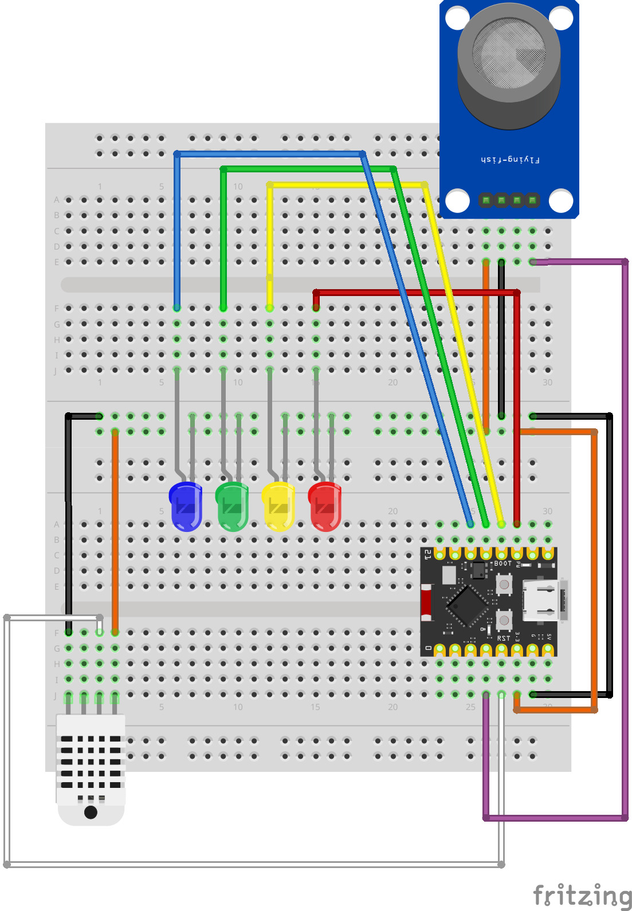

# POST TEST 2 - Smart House IoT System dengan Telegram Bot

## 👥 ANGGOTA KELOMPOK
2309106023 - Muhammad Guntur Adyatma
2409106029 - Ridho Setiawan
2409106038 - Triya Khairun Nisa

## 📖 Deskripsi
Proyek ini merupakan sistem Smart House berbasis Internet of Things (IoT) yang mengintegrasikan kontrol pencahayaan dan monitoring keamanan melalui Telegram Bot. Sistem menggunakan ESP32 sebagai mikrokontroler utama, dilengkapi sensor DHT11 (suhu & kelembapan), sensor gas MQ-2, dan 4 buah LED (3 LED pribadi + 1 LED Utama).

Fitur:
a) Role-based access control: Setiap anggota hanya bisa mengontrol LED miliknya dan LED Utama
b) Auto-warning system: Notifikasi otomatis ke telegram saat terdeteksi kebocoran gas
c) Real-time monitoring: Cek suhu & kelembapan kapan saja via Telegram
d) Shared control: LED Utama (Ruang Tamu) dapat dikontrol oleh semua anggota

## 🧑‍💻 Pembagian Tugas
1. [2309106023 - Muhammad Guntur Adyatma] → Pemrograman ESP32 pada Arduino IDE
2. [2409106029 - Ridho Setiawan] → Perancangan rangkaian (hardware)
3. [2409106038 - Triya Khairun Nisa] → Testing command & dokumentasi

## 🧰 Komponen yang Digunakan
1. ESP32 C3 Supermini
2. Sensor Gas MQ-2
3. Sensor Suhu & Kelembapan DHT11
4. 4 buah LED 
5. Breadboard
6. Kabel jumper
7. Platform IoT: Telegram Bot API

## 🔌 Board Schematic

| Komponen               | Pin ESP32-C3 Supermini | Kategori              | Keterangan                                      |
|------------------------|------------------------|-----------------------|-------------------------------------------------|
| LED 1 (Anggota A / Ridho)  | `GPIO 7`               | LED Personal          | Indikator pencahayaan personal User 1 (Ridho)   |
| LED 2 (Anggota B / Triya)  | `GPIO 8`               | LED Personal          | Indikator pencahayaan personal User 2 (Triya)   |
| LED 3 (Anggota C / Guntur) | `GPIO 9`               | LED Personal          | Indikator pencahayaan personal User 3 (Guntur)  |
| LED 4 (Ruang Tamu)         | `GPIO 10`              | LED Utama             | Pencahayaan bersama, dapat dikontrol semua user |
| Sensor MQ-2 (AOUT)         | `GPIO 3`               | Sensor Gas            | Membaca nilai analog konsentrasi gas (0–4095)   |
| Sensor MQ-2 (VCC)          | `3.3V`                 | Sensor Gas            | Sumber daya sensor gas                          |
| Sensor MQ-2 (GND)          | `GND`                  | Sensor Gas            | Ground sensor gas                               |
| Sensor DHT22 (DATA)        | `GPIO 4`               | Sensor Suhu & Lembap  | Membaca data suhu dan kelembapan udara          |
| Sensor DHT22 (VCC)         | `3.3V`                 | Sensor Suhu & Lembap  | Sumber daya sensor DHT22                        |
| Sensor DHT22 (GND)         | `GND`                  | Sensor Suhu & Lembap  | Ground sensor DHT22                             |

### Rincian Gambar

## 🖥️ Video Demonstrasi
https://youtu.be/XDXXI_93h9E

